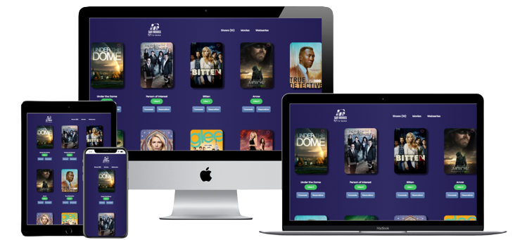

# Tv-rating

>  In this project we are making a Tv-rating webapp using an external API's

## Built With

- HTML
- CSS
- JavaScript
- Webpack

## Live Demo 

[Live Demo Link](https://artbsc1992.github.io/Tv-rating/)

## Getting Started

To get a local copy up and running follow these simple example steps.

- copy this link `https://github.com/artbsc1992/Tv-rating`.
- get the directory that you want to clone the repository.
- open the command prompt in this directory.
- write `git clone https://github.com/artbsc1992/Tv-rating`.
- go to the repository folder in your command prompt `cd Tv.rating`

## Authors

👤 **Arturo Hermida**

- GitHub: [@githubhandle](https://github.com/Artbsc1992)
- Twitter: [@twitterhandle](https://twitter.com/Arturo_D_Rock)
- LinkedIn: [LinkedIn](https://linkedin.com/in/arturo-hermida29)

👤 **Saifullah**

- GitHub: [@githubhandle](https://github.com/saifullah767)
- Twitter: [@twitterhandle](https://twitter.com/twitterhandle)
- LinkedIn: [LinkedIn](https://www.linkedin.com/in/saifullah-khan-b0637b169/)

👤 **Ronald Skinner**

- GitHub: [@githubhandle](https://github.com/rskinnerc)
- Twitter: [@twitterhandle](https://twitter.com/XSkinner)
- LinkedIn: [LinkedIn](https://linkedin.com/in/linkedinhandle)

## 🤝 Contributing

Contributions, issues, and feature requests are welcome!

Feel free to check the [issues page](../../issues/).

## Show your support

Give a ⭐️ if you like this project!

## 📝 License

This project is [MIT](./MIT.md) licensed.
